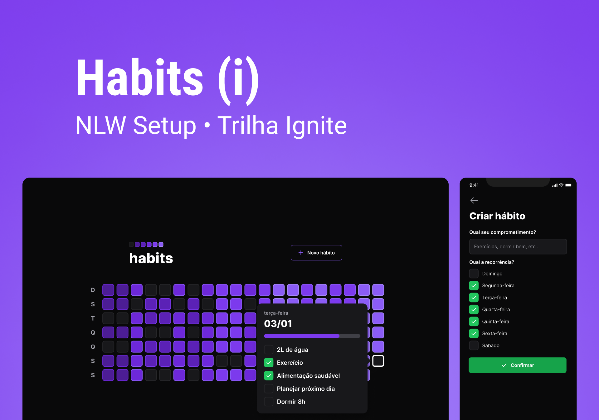

<p align="center">
   <a href="https://www.linkedin.com/in/filipefmotta/">
      
   </a>

  <a aria-label="Last Commit" href="https://github.com/filipefdm/dashgo/commits/master">
    
  </a>
</p>

<p align="center">
   
</p>

# Temas

- [O que é o Habits?](#o-que-é-o-habits)
- [Tecnologias](#tecnologias)
- [Como executar?](#como-executar)

## O que é o Habits?

<b>Habits</b> é uma aplicação desenvolvida durante o evento da Next Level Week da Rocketseat que possibilita o usuário:

- Cadastrar um novo hábito;
- Visualizar os hábitos de cada dia;
- Acompanhar todo o progresso dos hábitos.

## Tecnologias

Foram utilizadas as seguintes tecnologias e ferramentas:

- [NodeJS](https://nodejs.org/)
- [TypeScript](https://www.typescriptlang.org/)
- [Fastify](https://www.fastify.io/)
- [Prisma](https://www.prisma.io/)
- [ViteJS](https://vitejs.dev/)
- [ReactJS](https://reactjs.org/)
- [TailwindCSS](https://tailwindcss.com/)
- [React Native](https://reactnative.dev/)
- [Expo](https://expo.io/)

## Como executar?

### Web

```bash
# Install the web dependencies
$ cd web
$ npm install

# Start the web project
$ npm run dev
```

### Server

```bash
# Install the server dependencies
$ cd server
$ npm install

# Start the server project
$ npx prisma migrate deploy
$ npm run dev
```

### Mobile

```bash
# Install the mobile dependencies
$ cd mobile
$ npm install

# Start the mobile project
$ npm start
```

Acesse <http://localhost:5173> no navegador para ver o resultado!

---

Feito com 💜 por [Filipe Motta](https://github.com/filipefdm) 😊
